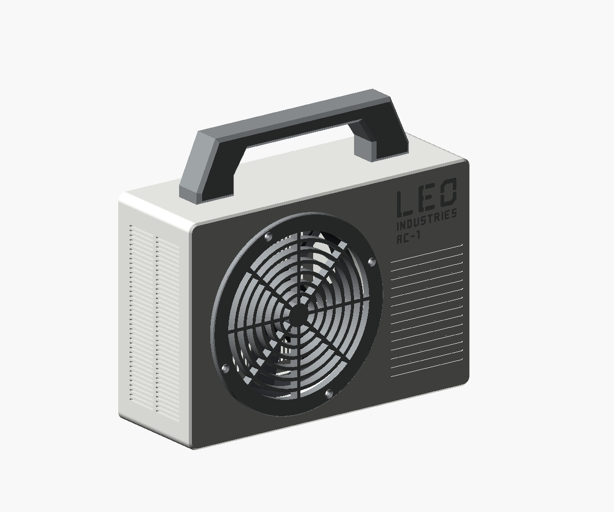
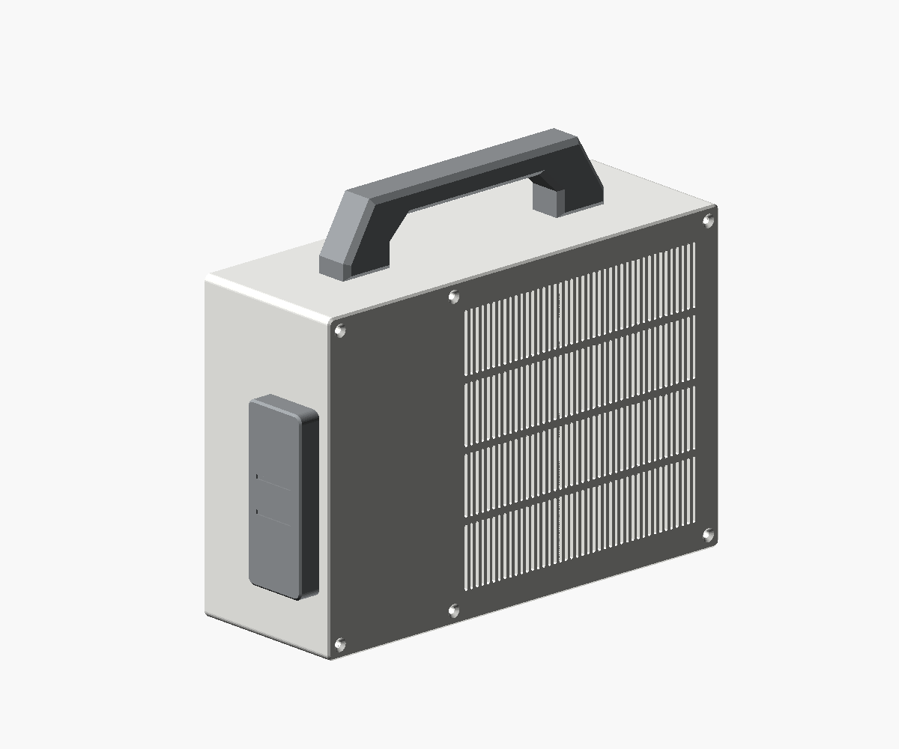
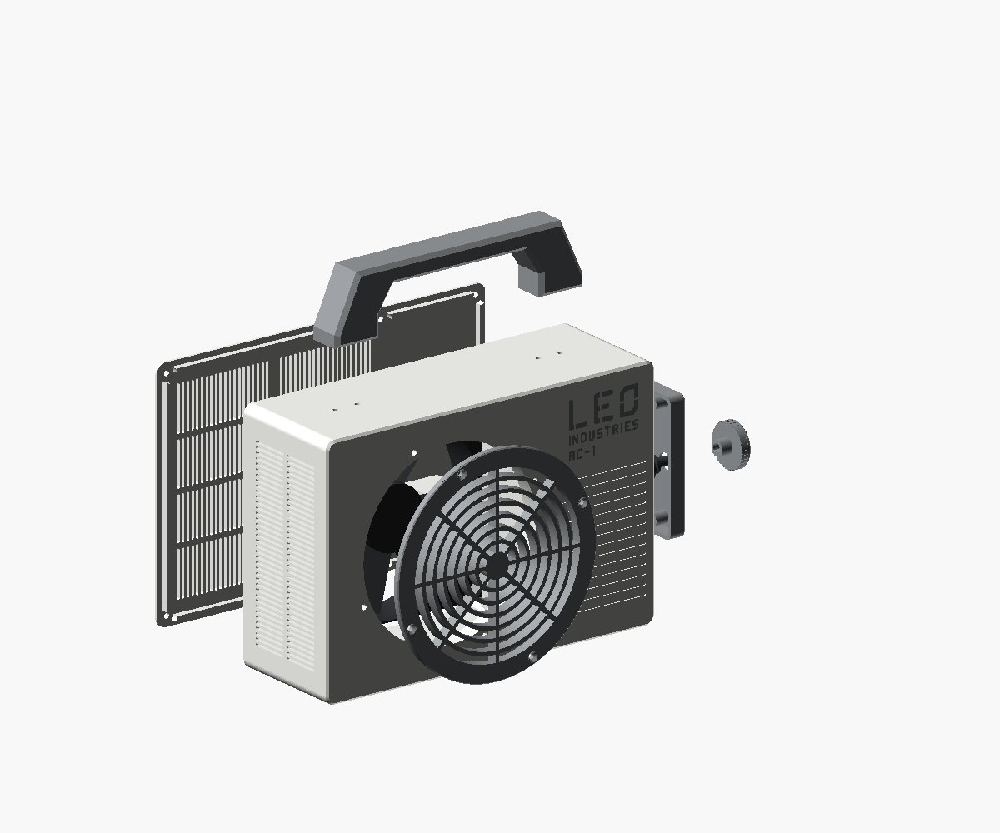
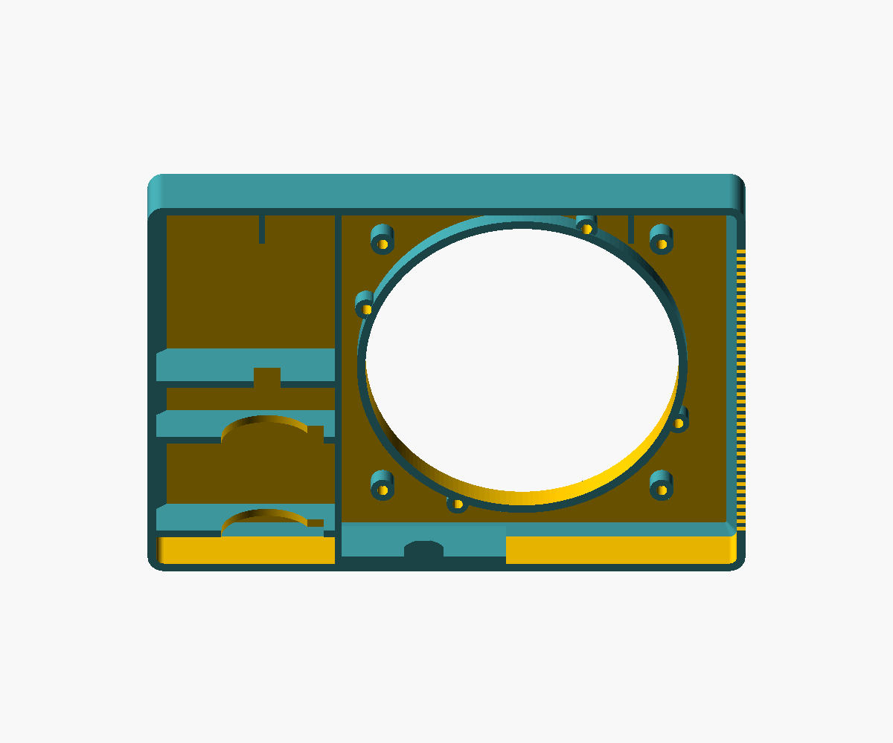
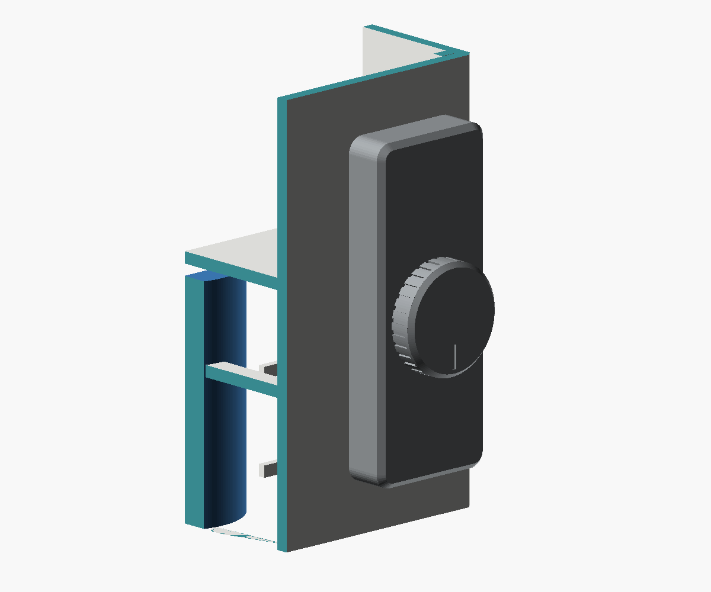

# LEO-AC1 — Ventilator im Klimaanlagen-Look

Kleiner Akku-Ventilator für das Kinderzimmer, gestaltet wie die Außeneinheit einer Split-Klimaanlage (Proportionen eines 800 × 550 × 285 mm großen Geräts). Ein 120-mm-PC-Lüfter bläst durch das runde Gitter nach vorn, die Luft kommt durch die Schlitze in der Rückwand und der linken Seite. Ein Luftkanal zwischen Front und Lüfterrahmen sorgt dafür, dass die Luft vorn herauskommt und nicht seitlich ins Gehäuse zurückströmt. Rechts auf der Front steht das Logo „LEO INDUSTRIES AC-1“ in eigener Blockschrift (LEO in Schablonen-Buchstaben) über waagerechten Zierrillen wie bei Mitsubishi-Außengeräten; dahinter liegt ein Fach für den Akku (3,2 V 6000 mAh LiFePO4, JST-PH 2.0) und die Elektronik. Gedruckt auf der Bambu Lab H2S in PETG Basic Weiß und Grau.



3D-Viewer (Artifact, wird nach jeder Modelländerung unter derselben URL erneuert): a private Claude viewer artifact

| Rückseite | Explosionsansicht | Logo und Rillen | Luftkanal von hinten | Servicedeckel mit Drehknopf |
|---|---|---|---|---|
|  |  |  |  |  |

## Teile

| Teil | Menge | Material | Maße (mm) | Drucklage |
|---|---|---|---|---|
| `body` Gehäuse | 1 | PETG weiß + grau (Typenschild) | 225 × 155 × 77,6 | Front aufs Bett, Logo als Einlage in den ersten 0,6 mm, Zierrillen 0,8 mm tief zur Bettseite offen |
| `back` Rückwand | 1 | PETG weiß | 225 × 155 × 40,6 | Außenseite aufs Bett, Akku-Halterippen stehen senkrecht |
| `grille` Lüftergitter | 1 | PETG grau | Ø 136 × 6 | Vorderseite aufs Bett |
| `cover` Servicedeckel | 1 | PETG grau | 84 × 34 × 11 | Außenseite aufs Bett |
| `knob` Drehknopf | 1 | PETG grau | Ø 28 × 13,7 (flache Kappe, steht 7 mm vor dem Servicedeckel) | Oberseite aufs Bett, Schaft mit D-Bohrung zeigt nach oben |
| `handle` Griff | 1 | PETG grau | 170 × 42 × 24 (30 mm Luft unter dem Balken, Öffnung oben 90 mm) | auf der Seite liegend (Schichten in Zugrichtung), Fasen 45° |

Alle Teile liegen als Bambu-Studio-Projekt in [`stl/leo_ac1_all_parts.3mf`](stl/leo_ac1_all_parts.3mf): Platte 1 Gehäuse (mit Wischturm), Platte 2 Rückwand, Platte 3 graue Teile (Gitter, Servicedeckel, Griff, Drehknopf). Filament 1 PETG Basic Weiß, Filament 2 PETG Basic Grau, Filament 3 Grau für das Typenschild (im AMS dieselbe Spule wie Filament 2). Wer das Gehäuse einfarbig druckt, nimmt `stl/body.stl`.

Rechnerisch **ca. 0,56 kg und 15,6 Stunden** (diagnostisches Slicen, jede Instanz als eigener Druck; Gehäuse allein 337 g / 7,7 h).

## Druck und Stabilität

Alle Teile drucken ohne Stützen (geprüft mit `analyze.py islands`, `overhangs` > 45°, `ridges`, `inlays`):

- Gehäuse mit der Front aufs Bett: Wände, Trennwand, Akkuwiege und Elektronikboden stehen senkrecht; Schrauben-Dome der Rückwand laufen mit 45°-Kegel in die Ecken; Seitenschlitze überbrücken nur 1,6 mm; Zierrillen sind zur Bettseite offen.
- Luftkanal: rundes Rohr Ø 118 mm (wie die Gitteröffnung), 1,6 mm Wand, von der Front bis 0,2 mm vor den Lüfterrahmen (geprüft: Wand rundum geschlossen, Rohrende liegt vollständig auf dem Rahmen); keine toten Ecken zwischen rundem Gitter und eckigem Rahmen.
- Sturzfest: Wände und Front 3,2 mm, Rückwand 3 mm, Eckradius 6 mm, 4-mm-Hohlkehle innen zwischen Front und Wänden, Gitterring 4 mm mit 2,4 mm Stäben, Versteifungsrippen innen unter den Griff-Füßen, zusätzliche Strebe in den Rückwandschlitzen.
- Einschmelzmuttern haben mindestens 3 mm Material bis zur Sichtfläche (Gitter 3,5 mm, Lüfter 3,9 mm, Servicedeckel 4,5 mm), damit sich die Front beim Eindrücken nicht verzieht.
- Gitterspalt 4,9 mm (Fingerschutz).
- Slicer-Profil: 6 Wände, 5 Decken-/Bodenlagen, 30 % Gyroid. PETG ist schlagzäher als PLA.

## Zukaufteile

| Teil | Menge | Hinweis |
|---|---|---|
| PC-Lüfter 120 × 120 × 25 mm | 1 | Lochabstand 105 mm; 12-V-Lüfter brauchen einen Step-up-Wandler |
| Akku 3,2 V 6000 mAh LiFePO4 mit Schutzplatine, JST-PH 2.0 (32700-Zelle, Ø 34 × 70 mm) | 1 | Nur mit LiFePO4-Ladegerät laden (3,65 V), **kein** TP4056 (4,2 V) |
| Lade-/Boostmodul „2-in-1 3,2 V LiFePO4“, Variante 12 V | 1 | 35,4 × 11 × 3,6 mm; Pads IN± (5 V laden), B± (Akku), O± (12 V, max. ca. 0,32 A) |
| PWM-Lüfterregler DC 8–24 V 5 A mit Drehpoti und Schalter | 1 | 4-Pin-Lüfter; Poti an der rechten Seitenwand unter dem Servicedeckel (Maße angenommen: WH148, D-Achse Ø 6 × 15, M7) |
| USB-C-Einbaubuchse 5 V | 1 | Zum Laden, Lage im Servicedeckel noch offen |
| Einschmelzmuttern Ruthex M3 × 5,7 | 20 | Loch Ø 4,0, Tiefe 6,5 |
| M3 × 14 Senkkopf | 4 | Gitter, von vorn |
| M3 × 30 Zylinderkopf | 4 | Lüfter, von hinten durch den Rahmen |
| M3 × 8 Senkkopf | 6 | Rückwand |
| M3 × 8 Zylinderkopf | 6 | Servicedeckel (2) und Griff (4), von innen |

## Zusammenbau

1. Einschmelzmuttern setzen: 4 Gitter- und 4 Lüfterdome innen an der Front, 6 Dome am hinteren Rand des Gehäuses, 2 im Servicedeckel, 4 in den Griff-Füßen.
2. Poti von innen durch die rechte Seitenwand stecken und außen mit seiner Mutter festziehen; Servicedeckel und Griff von innen mit M3 × 8 anschrauben; Drehknopf durch das Loch im Servicedeckel auf die Achse drücken (Zeigerstrich zur Achsabflachung).
3. Gitter von vorn aufsetzen (der Kragen zentriert es in der Öffnung) und mit M3 × 14 Senkkopf anschrauben.
4. Lüfter von hinten auf die Dome hinter dem Luftkanal setzen, Blasrichtung nach vorn, mit M3 × 30 anschrauben. Kabel durch die Aussparung in der Trennwand ins Elektronikfach führen.
5. Akku stehend von hinten in die Wiege schieben, Kabelende nach oben; das Kabel läuft durch den Schlitz im Elektronikboden darüber.
6. Rückwand aufsetzen (die Rippen halten den Akku mit 1 mm Luft) und mit M3 × 8 Senkkopf verschrauben.

## Offen

- Poti des PWM-Reglers, PWM-Platine und USB-C-Buchse messen (Lage im Elektronikfach, USB-C-Durchbruch).
- Akku und Lüfter nachmessen (Akku laut Etikett Ø 34 × 70 mm, im Modell Ø 35 × 72 mm; Lüfter nach Norm).
- Elektronik (Wandler, Laden, Schalter, Drehzahl) festlegen: Lage im Elektronikfach, Durchbrüche für Ladebuchse und Schalter (z. B. im Servicedeckel).

## Modell, Exporte und Prüfungen

Modell: [`leo_ac.scad`](leo_ac.scad), Einstellungen und Projektprüfungen: [`print_project.py`](print_project.py). Werkzeuge aus dem Skill `openscad-print-project` (Kopien in `scripts/`).

```sh
python3 -m venv .venv
.venv/bin/python -m pip install -r scripts/requirements.txt
.venv/bin/python scripts/print_tools.py export     # prüfen und stl/, asm/, docs/verification.json ersetzen
.venv/bin/python scripts/analyze.py islands        # schwebende Bereiche
.venv/bin/python scripts/analyze.py overhangs      # Überhänge > 45°, Brücken
.venv/bin/python scripts/slice_check.py            # Bambu-CLI, Projekt-3MF, docs/slicer-summary.json
.venv/bin/python scripts/build_viewer.py           # build/viewer.html
.venv/bin/python scripts/render_views.py           # img/
```

Geprüft werden: Teileliste gegen die `part`-Zweige, geschlossene Netze, Bettlage, Bauraum, keine Überschneidung zwischen 14 Baugruppenkörpern (91 Paare, inklusive Schrauben, Lüfter- und Akku-Hüllkörper), Auflagekontakt von Gitter, Lüfter, Rückwand, Deckel, Griff, Poti und Akku, Anschläge des Akkus (hinten 1,25 mm, oben 3,25 mm, seitlich 0,75 mm), 7 Ein- und Ausbauwege in realistischer Reihenfolge, 20 Insert-Aufnahmen (Achse frei, Ring und Boden voll), Einschraubtiefen (≥ 4,7 mm, Spitze ≥ 0,9 mm vor dem Taschenende), Normmaße (120-mm-Lüfter, Ruthex M3), Gitterspalt ≤ 6 mm (Fingerschutz), Mehrfarb-Deckung des Logos. Druckbarkeit: keine schwebenden Bereiche, Einlage auf Schicht 1 ohne zu schmale Stellen, Stege zwischen den Rillen ≥ 1,1 mm. Keine Festigkeits-, Luftstrom- oder Passungsprüfung am echten Teil.
