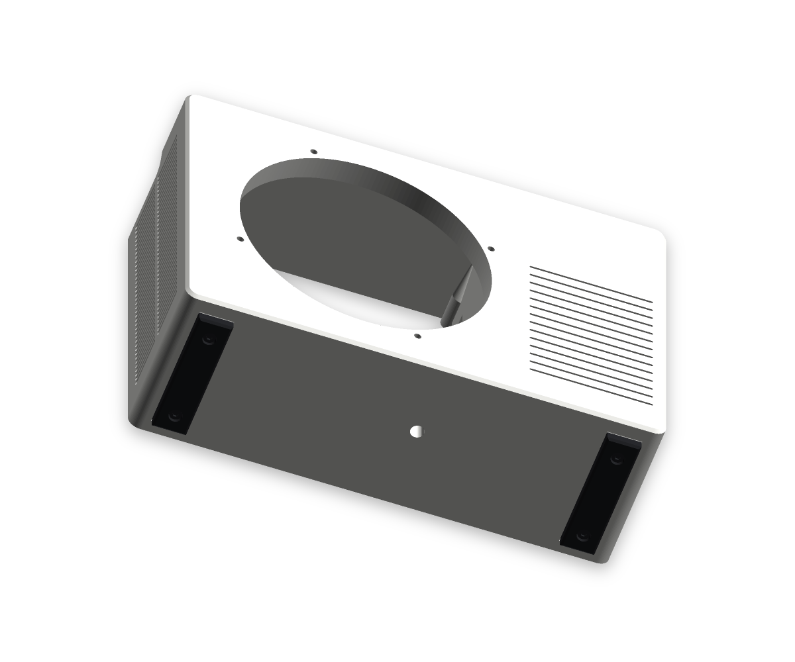
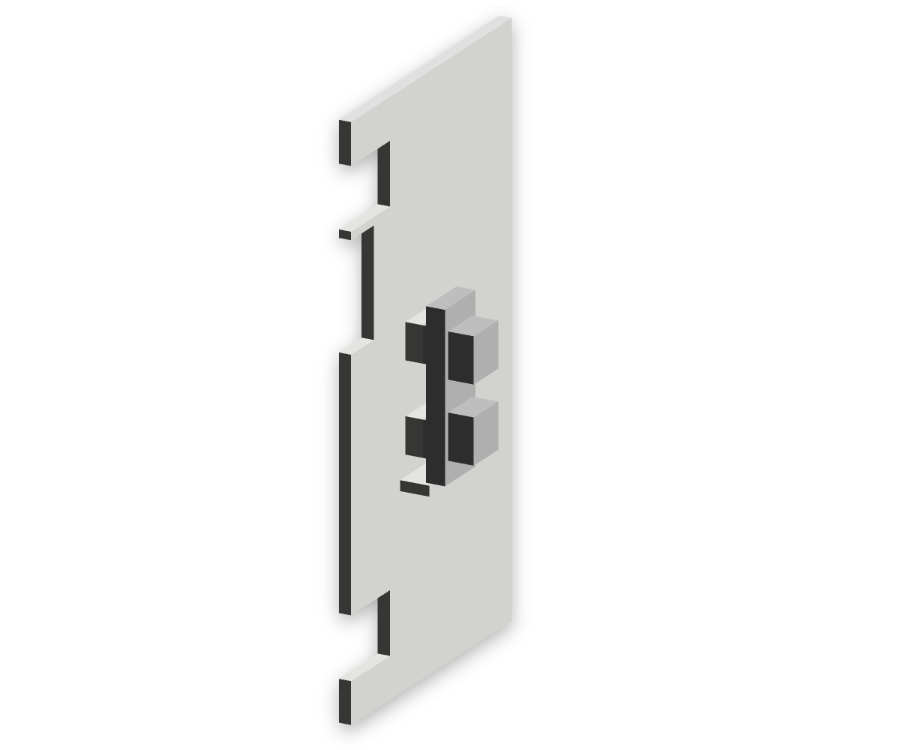
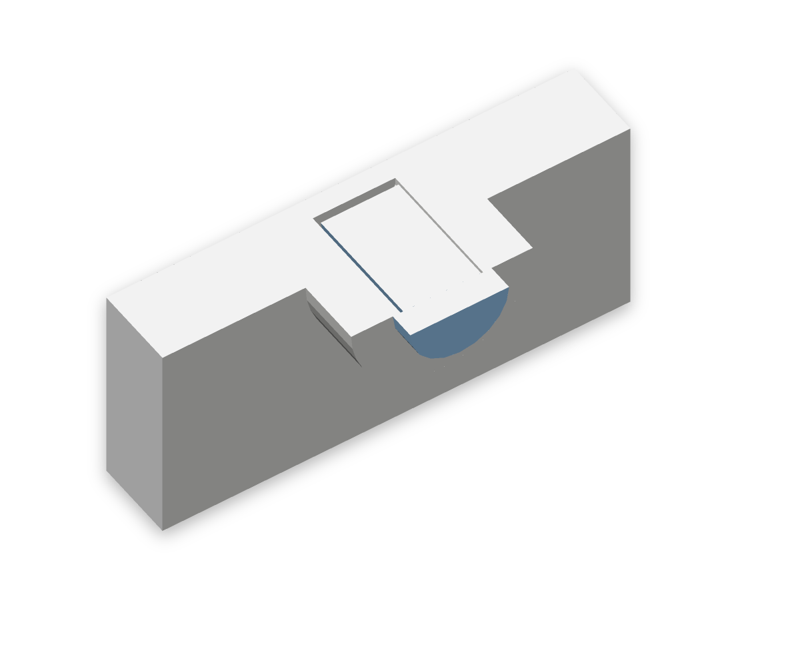
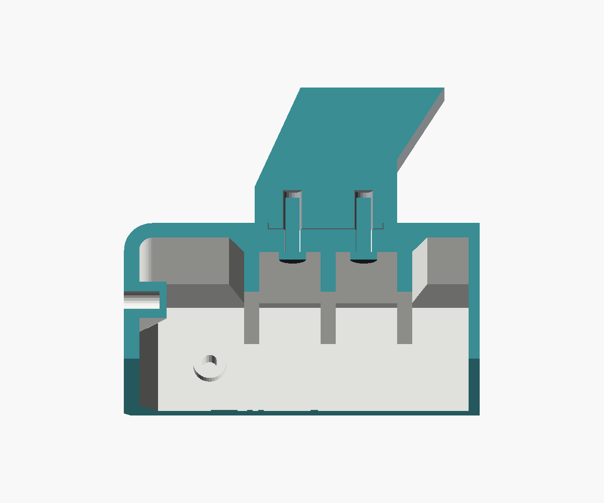
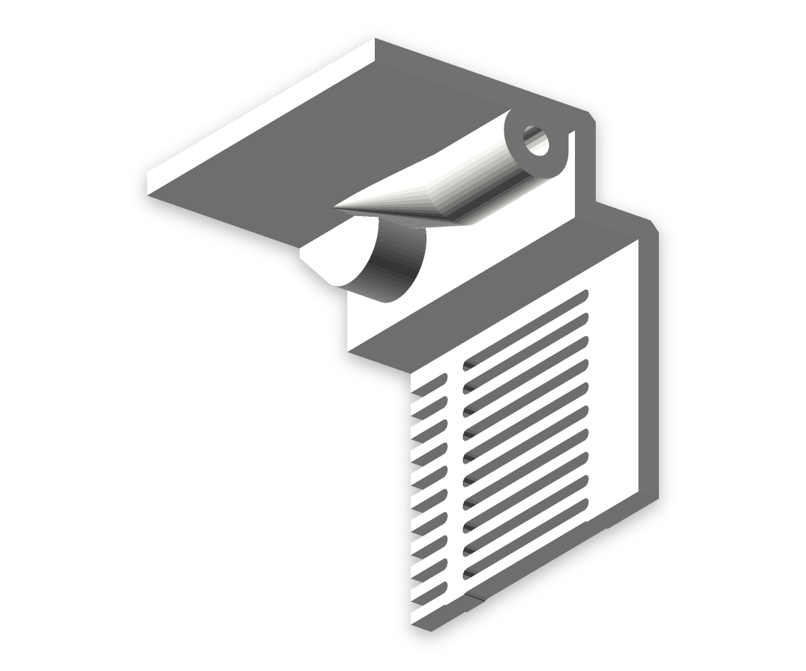
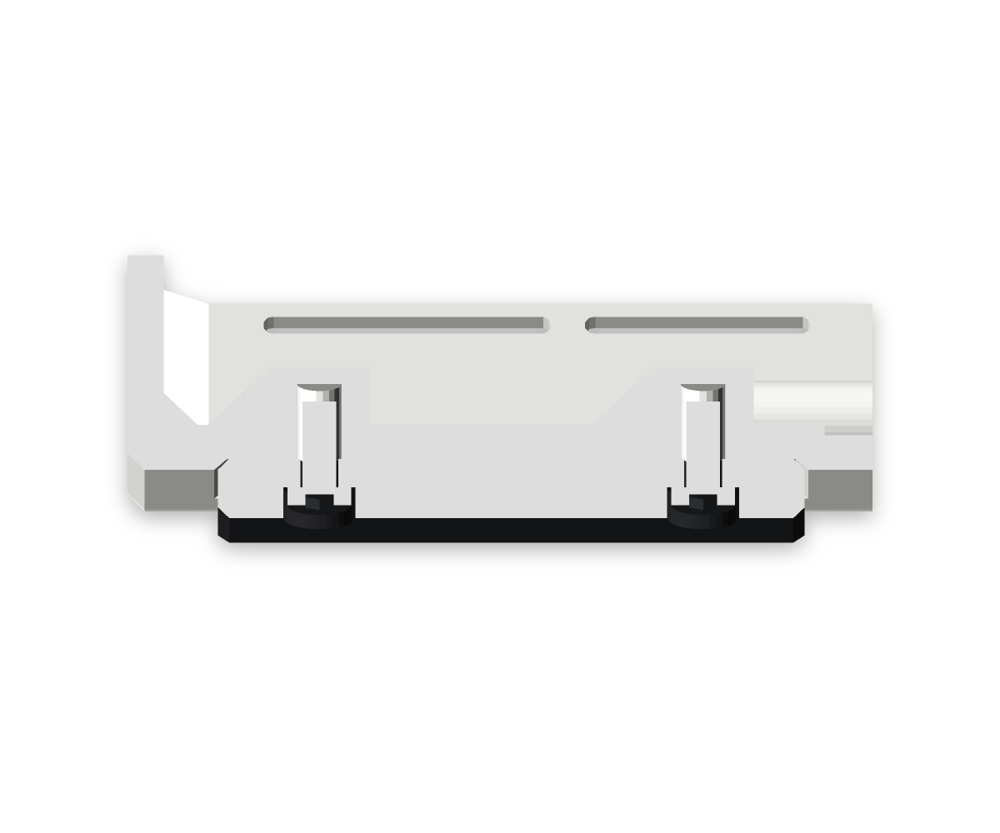
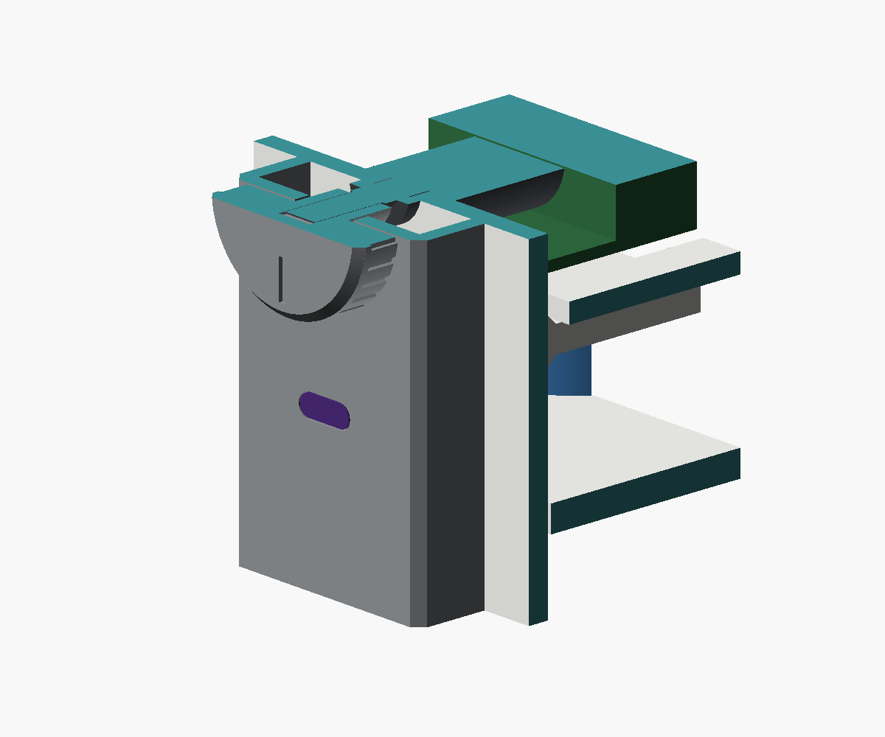

# LEO-AC1 — a fan that looks like an air conditioner

Small battery fan for a child's room, styled like the outdoor unit of a split air conditioner (proportions of an 800 × 550 × 285 mm unit). A 120 mm PC fan blows forward through the round grille; air enters through the slots in the back cover and the left side. A round air duct between the front and the fan frame makes sure the air leaves at the front instead of circulating back into the housing. On the right of the front sits the logo "LEO INDUSTRIES AC-1" in custom block letters (LEO as stencil letters) above horizontal fake grooves like on Mitsubishi outdoor units; a breathing LED glued in behind the O glows through the white PETG as charge indicator. Behind it is a bay for the battery (3.2 V 6000 mAh LiFePO4, JST-PH 2.0) and the electronics. Printed on a Bambu Lab H2S in PETG Basic white and grey.


3D viewer (artifact, republished under the same URL after every model change): a private Claude viewer artifact

| Back | Exploded | Logo and grooves | Air duct from behind | Service cover with knob | Underside with M5 thread and TPU feet | Charge module in the air stream | LED pocket behind the O | Dedication inside the front | Handle mount, cut at the screws | Back cover bosses | TPU foot, cut at the screws | USB-C socket in the service cover |
|---|---|---|---|---|---|---|---|---|---|---|---|---|
|  |  |  |  |  |  |  |  |  |  |  |  |  |

## Printed parts

| Part | Qty | Material | Size (mm) | Print orientation |
|---|---|---|---|---|
| `body` housing | 1 | PETG white + grey (logo) | 225 × 155 × 77.6 | front on the bed, logo as inlay in the first 0.6 mm, fake grooves 0.8 mm deep and open towards the bed; "Für Leo von Papa" with the date 14.09.2026 raised 0.8 mm in grey on the inside of the front plate, readable with the back cover off |
| `back` back cover | 1 | PETG white | 225 × 155 × 55 | outside on the bed, the three battery saddles and the hold-down plate stand upright |
| `grille` fan grille | 1 | PETG grey | Ø 136 × 6 | front on the bed |
| `cover` service cover | 1 | PETG grey | 116 × 34 × 11 | outside on the bed; right side, centred in depth, knob at the top; screwed from outside (heads recessed) |
| `foot` foot | 2 | TPU (black) | 16 × 62 × 5.5 (lifts the housing 4.5 mm) | ground face on the bed; screwed with two M3 × 8 from below, heads recessed 1.2 mm |
| `knob` speed knob | 1 | PETG grey | Ø 28 × 13.7 (flat cap, 7 mm proud of the service cover) | top on the bed, stem with D bore points up |
| `handle` handle | 1 | PETG grey | 170 × 42 × 24 plus 1.2 mm keys under the feet (30 mm clearance under the bar, 90 mm opening at the top) | lying on its side (layers along the pull direction), 45° bevels, keys with 45° flanks |

All parts are in the Bambu Studio project [`stl/leo_ac1_all_parts.3mf`](stl/leo_ac1_all_parts.3mf): plate 1 housing (with prime tower), plate 2 back cover, plate 3 grey parts (grille, service cover, handle, knob), plate 4 TPU feet. Filament 1 PETG Basic white, filament 2 PETG Basic grey, filament 3 grey for the logo and the dedication (same AMS spool as filament 2), filament 4 TPU (Generic TPU profile; set your TPU). To print the housing in one colour, use `stl/body.stl`.

Estimated **approx. 0.70 kg and 20.7 hours** (diagnostic slicing, every instance as its own print; housing alone 397 g / 10.2 h, the two TPU feet 13 g / 1.2 h).

## Bought parts

| Part | Qty | Link | Notes |
|---|---|---|---|
| Fan Noctua NF-F12 industrialPPC-2000 PWM | 1 | [noctua.at](https://noctua.at/en/nf-f12-industrialppc-2000-pwm) | 120 × 25 mm, hole spacing 105 mm, 12 V, max. 0.1 A / 1.2 W, 2000 rpm, 122 m³/h, 3.94 mm H₂O; silicone corner pads 1 mm proud of both frame faces (from the Noctua CAD); the pads rest on the bosses, M3 × 30 engages 3 mm, tighten by hand only |
| Battery 3.2 V 6000 mAh LiFePO4 pack with protection board (BMS), JST-PH 2.0 (32700 cell, Ø 34 × 70 mm) | 1 | [eremit.de](https://www.eremit.de/p/3-2v-6000mah-pack-mit-schutz-arduino-aio-jst-ph-2-0-stecker) | charge only with a LiFePO4 charger (3.65 V), **no** TP4056 (4.2 V) |
| Charge/boost module "2-in-1 3.2 V LiFePO4", **12 V variant** | 1 | [AliExpress 1005008094801881](https://de.aliexpress.com/item/1005008094801881.html) | 35.4 × 11 × 3.6 mm; pads IN± (5 V charging), B± (battery), O± (12 V, max. approx. 0.32 A); stands upright on the partition in the air stream 5 mm behind the fan, taped onto two pads, lower short edge on a ledge (pads and components at the edges stay free) |
| PWM fan controller CNY-FA5-PRO, DC 8–24 V 5 A, with potentiometer and switch | 1 | [AliExpress 1005010113177510](https://de.aliexpress.com/item/1005010113177510.html) | 4-pin fan; right-angle potentiometer on the board edge. The board lies flat on two ribs above the electronics shelf, potentiometer edge against the right wall, held by the potentiometer nut; knob above the battery, centred in depth (assumed: board 48 × 34 mm, components 13 mm high, potentiometer axis 8.5 mm above the board, potentiometer WH148 with D shaft Ø 6 × 15, M7) |
| LED 3 mm, breathing/fading, 3.3 V, water clear, through-hole | 1 | [AliExpress 1005005336879647](https://de.aliexpress.com/item/1005005336879647.html) | charge indicator, pulses while the USB charger is plugged in; glued from inside into the pocket behind the O of LEO: Ø 3.2 blind hole, 0.8 mm white PETG left in front of the LED, flange rests on a Ø 7 boss; wiring below |
| Resistor 220 Ω, 1/4 W | 1 | – | series resistor for the LED on the 5 V USB input (approx. 8 mA) |
| Aluminium heatsink 8.8 × 8.8 × 5 mm with thermal adhesive tape | 2 | – | on the chips of the charge/boost module, fins along the air flow |
| Double-sided, heat-resistant tape | – | – | for the charge module on its two pads: double-sided Kapton (sand the pads flat) or 3M VHB; no hot glue |
| Resettable PTC fuse Bourns MF-R160 (1.6 A hold / 3.2 A trip) | 1 | – | optional, between battery plus and B+ (check the datasheet) |
| USB-C PD trigger module, Type A (default 5 V) | 1 | [AliExpress 1005010610660644](https://de.aliexpress.com/item/1005010610660644.html) | charging socket, 13 × 10 × 4 mm: sits in a sleeve inside the service cover, receptacle flush in the cover plate, its end in a pocket of the right wall; **leave pads 1–4 open** (1 = 9 V, 2 = 12 V, 3 = 15 V, 4 = 20 V), the charge module only takes 4–6 V; check 5 V with a multimeter before connecting |
| Heat-set inserts Ruthex RX-M3x5.7 | 24 | [ruthex.de](https://www.ruthex.de) | hole Ø 4.0, depth 7 (datasheet: ≥ L + 1 = 6.7), wall ≥ 1.6 |
| Heat-set insert Ruthex RX-M5x9.5 | 1 | [ruthex.de](https://www.ruthex.de) | mounting thread in the underside (like a tripod thread): pressed in from outside, blind hole Ø 6.4 × 10.5 (L + 1), 2.5 mm floor above; wall 4.3 mm (datasheet ≥ 2.6) |
| M3 × 12, ISO 7380 Torx | 4 | – | grille, from the front, head recessed 1.9 mm in the grille ring |
| **M3 × 30**, ISO 7380 Torx | 4 | – | fan, from behind through the frame (not in the nas-case screw set, buy separately) |
| M3 × 8, ISO 7380 Torx | 6 | – | back cover, from outside, head recessed 1.9 mm |
| M3 × 12, ISO 7380 Torx | 4 | – | handle, from inside through the top wall and its doubler |
\1
| M3 × 8, ISO 7380 Torx | 4 | – | TPU feet, from below, heads 1.2 mm below the ground face |

## Wiring

```
USB-C PD trigger 5 V ─┬──► IN+ / IN−   charge/boost module (12 V) ──► O+ / O− 12 V ──► PWM controller "DC 8–24V" ──► 4-pin fan
                      └──► 220 Ω ──► LED (charge indicator) ──► IN−
battery (JST-PH, built-in BMS) ──► (PTC) ──► B+ / B−
```

- The module charges the battery with up to 1 A to 3.6 V and delivers 12 V at the same time (UPS mode): the fan keeps running while charging. Use a power supply with at least 2 A.
- The BMS in the battery stays as a second protection layer (overcharge, deep discharge, short circuit); the module cuts off earlier at 2.6 V.
- The module sits directly behind the fan in the intake air, 2 mm off the partition, with two heatsinks. According to a buyer review the chip reaches approx. 70 °C when charging with 1 A without cooling; with R3 = 2.4 kΩ it charges with 0.5 A and stays cooler.
- Power: the NF-F12 industrialPPC-2000 draws at most 1.2 W, so the module runs at approx. 31 % of its 3.84 W. Runtime roughly 10 h at full speed, 20 h at 70 % speed (battery 19.2 Wh, approx. 85 % efficiency).
- LED as charge indicator: anode (long leg) via the 220 Ω resistor to IN+, cathode to IN− of the charge module, i.e. directly on the 5 V from the USB-C PD trigger (or at its + / − pads). It pulses whenever the charger is plugged in and is dark on battery, so it costs no runtime. It does not switch off when the battery is full: the module keeps the battery at 3.6 V and powers the fan from USB. If the module turns out to have its own charge LED, the external LED can be wired to that LED's cathode pad instead (with its own 220 Ω from IN+); then it goes dark when the battery is full. The breathing LED has its own IC; if it flickers or stays dim, try 150 Ω.

## Assembly

1. Press in the heat-set inserts: 4 grille and 4 fan bosses inside the front, 6 bosses on the back edge of the housing, 2 from outside into the right side wall under the service cover, 4 in the handle feet; the M5 insert and 4 M3 inserts for the TPU feet from below into the blind holes in the underside.
2. Glue the LED from inside into the pocket behind the O of LEO (top right behind the front; a drop of clear glue or hot glue on the flange), bend the legs back and solder the resistor and wires.
3. Slide the PWM board in from behind, potentiometer edge first, onto the two ribs above the electronics shelf; push the potentiometer through the right side wall and tighten its nut outside; put the handle on (its keys sit in the recesses of the top wall) and screw it on from inside with M3 × 12 and the service cover from outside with M3 × 16 (before that, solder the wires to + and − of the USB-C module, push it into the sleeve on the inside of the cover with the receptacle in the opening, and lead the wires through the slot in the right wall; the wall holds the module once the cover is on); press the knob through the hole in the service cover onto the shaft (pointer line towards the flat of the shaft).
4. Put the grille on from the front (the collar centres it in the opening) and screw it on with M3 × 12.
5. Put the fan from behind onto the bosses behind the air duct, blowing forward, and screw it on with M3 × 30. Route the cable through the notch in the partition into the electronics bay. Tape the charge/boost module with its heatsinks (component side towards the fan) upright onto the two pads on the partition, lower edge on the ledge, O± end up towards the cable notch.
6. Slide the battery upright in from behind into the cradle, cable end up and BMS board towards the partition (rectangular cut-out in the cradle); the cable runs through the slot in the electronics shelf above.
7. Put the two TPU feet into the pockets in the underside and screw each on with two M3 × 8 from below; tighten only until the TPU just starts to compress.
8. Put on the back cover (its three saddles close the cradle to rings with 0.5 mm clearance all around, the hold-down plate covers the back edge of the shelf) and screw it on with M3 × 8.

## Print and robustness

All parts print without supports (checked with `analyze.py islands`, `overhangs` > 45°, `ridges`, `inlays`):

- Housing with the front on the bed: walls, partition, battery cradle and electronics shelf stand upright; the back cover bosses run into the corners with cones flatter than 45°; side slots only bridge 1.6 mm; fake grooves and the LED pocket are open towards the inside; the dedication grows upwards from the inside of the front plate in grey (colour change only for its four layers at 3.2–4.0 mm).
- Air duct: round tube Ø 118 mm (like the grille opening), 3.2 mm wall, from the front to 0.2 mm in front of the fan frame (checked: wall closed all around, tube end sits fully on the frame); no dead corners between the round grille and the square frame.
- Drop-proof: walls and front 3.2 mm, back cover 4 mm (screw heads recessed), corner radius 6 mm, 4 mm fillet inside between front and walls, grille ring 4 mm with 2.4 mm bars, extra bar in the back cover slots.
- Back cover mounting: the six insert bosses at the back edge are Ø 10 mm (3 mm of material around the insert hole instead of 2 mm) and 16 mm long, joined to the wall corners and the partition by 20 mm long cones, so a drop onto the back cover does not snap them off.
- Handle mount: under each foot the top wall is doubled to 6.4 mm, with three 3.2 mm ribs from the front plate to the back lip (7 mm driver room next to the screws). A 1.2 mm key under each foot sits in a matching recess (0.2 mm clearance), so a drop or a jerk on the handle is taken as shear by the housing instead of bending the screws. The inserts start at the key face (pocket 8.5 mm), M3 × 12 engages the full 5.7 mm.
- Heat-set inserts have at least 3 mm of material to the visible face (grille 3.5 mm, fan 3.9 mm, service cover 4.5 mm), so the front does not warp when pressing them in.
- Grille gap 4.9 mm (finger guard).
- M5 mount: the insert is pressed from outside into a blind hole (10.5 mm = L + 1 per datasheet) with a 2.5 mm floor above; the load on the mount presses it against this floor. The boss is deliberately only Ø 15 mm: its 4.3 mm wall is printed fully solid with 6 wall loops instead of infill. Plus a rib towards the back, a 45° ramp to the front and a 3 mm floor doubler inside from the front to the partition (60 × 56 mm) that leads leverage into the front and the partition. For real camera accessories there is also Ruthex RX-1/4x12.7 (1/4"-20, hole Ø 8.0, wall ≥ 3.3).
- Battery drop-proof: three closed rings (4 mm) around the cell, at the front as ribs in the housing, at the back as saddles across the whole bay on the back cover, 0.5 mm clearance all around with a cut-out for the BMS board. The electronics shelf above is 4 mm thick with 3 mm fillets on both sides into the partition and the side wall; a hold-down plate on the back cover rests 0.2 mm above its free back edge, so a drop onto the top cannot break the shelf off. Add a thin foam strip between battery and saddles if you like.
- Feet: two TPU strips (16 × 62 mm, 4.5 mm under the housing), each screwed with two M3 × 8 button heads from below into Ruthex inserts. The inserts are pressed from outside into Ø 9 bosses inside the bottom wall (2.5 mm around the hole). The top of each foot sits 1 mm deep in a pocket of the bottom wall with 45° ends, so sideways pushes go into the housing and not into the screws; 2.65 mm of TPU are clamped under each head, the heads stay 1.2 mm above the table. A floor doubler inside keeps the bottom wall at 3.2 mm.
- Slicer profile: 6 wall loops, 5 top/bottom layers, 30 % gyroid. PETG is tougher than PLA.

## Open items

- Measure the BMS board on the battery (assumed 16 × 4 mm over the full length, facing the partition).
- Measure the PWM board CNY-FA5-PRO (assumed 48 × 34 mm, components 13 mm, potentiometer axis 8.5 mm above the board) and the potentiometer shaft (shape, length).
- Measure the battery (label Ø 34 × 70 mm, model Ø 35 × 72 mm) and its cable exit.
- Measure the USB-C PD trigger (listing 13 × 10 × 4 mm; the receptacle must reach at least 2.4 mm beyond the board to sit flush in the cover plate).

## Model, exports and checks

Model: [`leo_ac.scad`](leo_ac.scad), settings and project checks: [`print_project.py`](print_project.py). Tools from the skill `openscad-print-project` (copies in `scripts/`). The Noctua CAD for the viewer is not part of the repo (licence): put `NF-F12_iPPC.stl` into `vendor/noctua/`.

```sh
python3 -m venv .venv
.venv/bin/python -m pip install -r scripts/requirements.txt
.venv/bin/python scripts/print_tools.py export     # check and replace stl/, asm/, docs/verification.json
.venv/bin/python scripts/analyze.py islands        # floating regions
.venv/bin/python scripts/analyze.py overhangs      # overhangs > 45°, bridges
.venv/bin/python scripts/slice_check.py            # Bambu CLI, project 3MF, docs/slicer-summary.json
.venv/bin/python scripts/build_viewer.py           # build/viewer.html
.venv/bin/python scripts/render_views.py           # img/
```

Checked: part list against the `part` branches, closed meshes, bed placement, build volume, no intersection between 21 assembly bodies (210 pairs, including the TPU feet and their screws, the USB-C module, the assumed PWM board, LED, screws, fan and battery envelopes), contact of grille, fan, back cover, service cover, handle, feet, USB-C module (wall pocket and cover plate), potentiometer, charge module, LED and battery, stops of the battery (back, top, side), 12 assembly/removal paths (including the feet downwards, the USB-C module with the cover and then out of its sleeve, the charge module towards the back before the fan, and the PWM board: first 19 mm away from the wall, then towards the back) in a realistic order, 25 insert holes (24 × M3, 1 × M5; axis free, full minimum wall per Ruthex datasheet, floor solid), screw engagement (≥ 3 mm = 1 × d in the brass, fan on silicone pads 3 mm, others ≥ 4.8 mm; tip ≥ 0.9 mm before the end of the pocket), standard dimensions (120 mm fan, Ruthex M3), grille gap ≤ 6 mm (finger guard), multicolour coverage of logo and dedication. Printability: no floating regions, logo and dedication on their first layer without too narrow spots, ridges between the grooves ≥ 1.1 mm. No strength, airflow or fit test on the real part.
