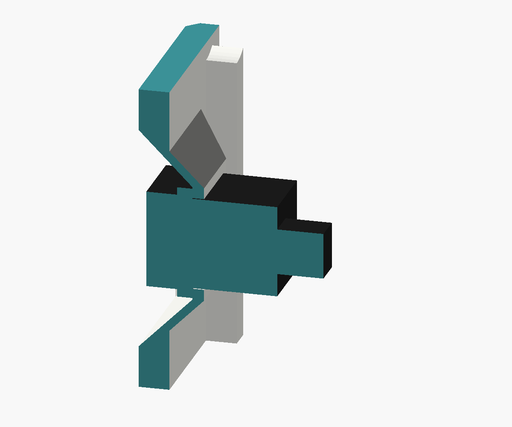
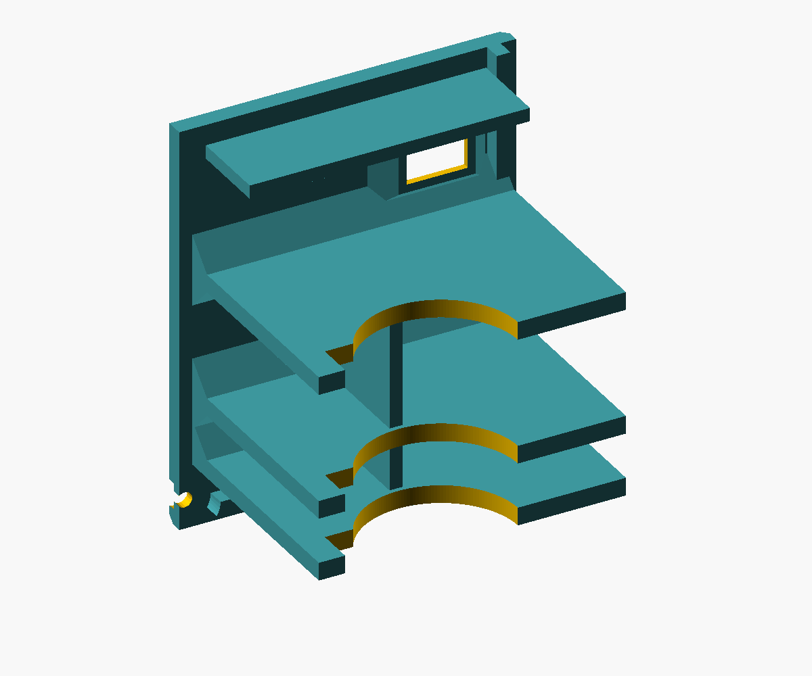

# LEO-AC1 — a fan that looks like an air conditioner

Small battery fan for a child's room, styled like the outdoor unit of a split air conditioner (proportions of an 800 × 550 × 285 mm unit). A 120 mm PC fan blows forward through the round grille; air enters through the slots in the back cover and the left side. A round air duct between the front and the fan frame makes sure the air leaves at the front instead of circulating back into the housing. On the right of the front sits the logo "LEO INDUSTRIES AC-1" in custom block letters (LEO as stencil letters) above horizontal fake grooves like on Mitsubishi outdoor units; a breathing LED glued in behind the O glows through the white PETG while the charger is plugged in. Behind it is a bay for the battery (3.2 V 6000 mAh LiFePO4, JST-PH 2.0) and the electronics. Designed for printing on a Bambu Lab H2S in PETG Basic white and grey.


The current local 3D viewer is generated at `build/viewer.html`. The [published Claude artifact](a private Claude viewer artifact) has not been republished by this measurement update and may show an earlier model.

| Back | Exploded | Logo and grooves | Air duct from behind | Service cover with knob | Underside with M5 thread and TPU feet | Charge module in the air stream | LED pocket behind the O | Dedication inside the front | Handle mount, cut at the screws | Back cover bosses | TPU foot, cut at the screws | USB-C socket in the back cover, cut at its axis | Power switch in its well | Battery saddles on the back cover |
|---|---|---|---|---|---|---|---|---|---|---|---|---|---|---|
|  |  |  |  |  |  |  |  |  |  |  |  |  |  |  |

## Printed parts

Dimensions below come from the rebuilt meshes dated 2026-09-15. The assembly envelopes were checked. All parts print without support; physical hardware fit still needs a print test. See the [current audit addendum](docs/hardware-measurements.md).

| Part | Qty | Material | Size (mm) | Print orientation |
|---|---|---|---|---|
| `body` housing | 1 | PETG white + grey (logo) | 225 × 155 × 76 | front on the bed, logo as inlay in the first 0.6 mm, fake grooves 0.8 mm deep and open towards the bed; "Für Leo von Papa" with the date 14.09.2026 raised 0.8 mm in grey on the inside of the front plate, readable with the back cover off |
| `back` back cover | 1 | PETG white | 225 × 155 × 55.75 | outside on the bed, the three battery saddles and the hold-down plate stand upright |
| `grille` fan grille | 1 | PETG grey | Ø 136 × 7 | front on the bed |
| `cover` service cover | 1 | PETG grey | 74.4 × 46 × 11.8 including glue rim | outside on the bed; right side below the knob, centred in depth, half-round notch around the knob in its upper edge (3 mm finger room plus a 3 mm chamfer); glued in: a 1.2 mm rim sits 0.8 mm deep in a groove of the side wall with 45° flanks. Rim and groove are interrupted beside the potentiometer recess to preserve its mounting wall |
| `foot` foot | 2 | TPU (black) | 16 × 62 × 5.5 (lifts the housing 4.5 mm) | ground face on the bed; screwed with two M3 × 8 from below, heads recessed 1.2 mm |
| `knob` speed knob | 1 | PETG grey | nominal Ø 28 × 14.3; white pointer on the top | top on the bed with the pointer as inlay in the first 0.6 mm; underside with a circular bore and slotted clamping sleeve for the measured round, splined shaft points up |
| `handle` handle | 1 | PETG grey | 170 × 42 × 24 plus 1.2 mm keys under the feet (30 mm clearance under the bar, 90 mm opening at the top) | lying on its side (layers along the pull direction), 45° bevels, keys with 45° flanks |

All parts are in the Bambu Studio project [`stl/leo_ac1_all_parts.3mf`](stl/leo_ac1_all_parts.3mf): plate 1 housing (with prime tower), plate 2 back cover, plate 3 grey parts (grille, service cover, handle, knob), plate 4 TPU feet. Filament 1 PETG Basic white, filament 2 PETG Basic grey, filament 3 grey for the logo and the dedication (same AMS spool as filament 2), filament 4 TPU (Generic TPU profile; set your TPU), filament 5 white for the pointer on the knob (same AMS spool as filament 1; plate 3 gets a small prime tower). To print the housing in one colour, use `stl/body.stl`.

Updated diagnostic estimate: **approx. 0.71 kg and 21.1 hours** for the four project plates, including their prime towers (housing plate 404 g / 10.64 h, back cover 167 g / 5.48 h, grey parts 130 g / 3.92 h, two TPU feet 13 g / 1.05 h). All seven individual parts and all four plates slice without CLI warnings. The separate single-part estimate in `docs/slicer-summary.json` totals 708.8 g / 21.1 h.

## Bought parts

| Part | Qty | Link | Notes |
|---|---|---|---|
| Fan Noctua NF-F12 industrialPPC-2000 PWM | 1 | [noctua.at](https://noctua.at/en/nf-f12-industrialppc-2000-pwm) | 120 × 25 mm, hole spacing 105 mm, 12 V, max. 0.1 A / 1.2 W, 2000 rpm, 122 m³/h, 3.94 mm H₂O; silicone corner pads 1 mm proud of both frame faces (from the Noctua CAD); the pads rest on the bosses, M3 × 30 engages 3 mm, tighten by hand only |
| Battery 3.2 V 6000 mAh LiFePO4 pack with protection board (BMS), JST-PH 2.0 | 1 | [eremit.de](https://www.eremit.de/p/3-2v-6000mah-pack-mit-schutz-arduino-aio-jst-ph-2-0-stecker) | cell body measured Ø 32.50 × 71.60 mm without the side protection/BMS board; BMS and cable exit remain to be measured. Charge only with a LiFePO4 charger (3.65 V), **no** TP4056 (4.2 V) |
| Charge/boost module "2-in-1 3.2 V LiFePO4", **12 V variant** | 1 | [AliExpress 1005008094801881](https://de.aliexpress.com/item/1005008094801881.html) | measured 32.20 × 11.00 × 3.70 mm including components; back completely clear; no heatsinks fitted yet. Pads IN± (5 V charging), B± (battery), O± (12 V, max. approx. 0.32 A per the existing specification); stands upright on the partition, taped onto two pads, lower short edge on a ledge. Measurements below supersede the previous 35.4 × 11 × 3.6 mm assumption |
| PWM fan controller CNY-FA5-PRO, DC 8–24 V 5 A, with potentiometer and switch | 1 | [AliExpress 1005010113177510](https://de.aliexpress.com/item/1005010113177510.html) | measured PCB outline 41.05 × 32.00 mm, populated module height 15.00 mm without the plugged fan connector; total length including potentiometer to shaft tip 56.30 mm. Round splined, split shaft Ø 5.80 × 9.50 mm; threaded section Ø 6.73 × 3.60 mm; axis approx. 6.00 mm above the PCB top. The shoulder rests on the full side wall; washer (0.35 mm) and nut (2.15 mm) sit in a counterbore outside under the knob. No D shaft; see measured hardware below |
| LED 3 mm, breathing/fading, 3.3 V, water clear, through-hole | 1 | [AliExpress 1005005336879647](https://de.aliexpress.com/item/1005005336879647.html) | USB power indicator: pulses while the charging cable is plugged in (it does not show the charge state); glued from inside into the pocket behind the O of LEO: Ø 3.2 blind hole, 0.8 mm white PETG left in front of the LED, flange rests on a Ø 7 boss; wiring below |
| Resistor 220 Ω, 1/4 W | 1 | – | series resistor for the LED on the 5 V USB input (approx. 8 mA) |
| Planned aluminium heatsink 8.8 × 8.8 × 5 mm with thermal adhesive tape | 2 planned | – | not yet present; these dimensions and the modelled positions are clearance reservations, not measurements of fitted parts. Confirm chip locations and the actual cooling arrangement before installation |
| 2K epoxy or CA gel | – | – | service cover: a thin bead in the groove of the side wall, press the cover in |
| Double-sided, heat-resistant tape, up to 1.1 mm thick | – | – | for the charge module on its two pads: 3M VHB 1.1 mm (modelled, the pads are 1.1 mm shorter for it) or thinner double-sided Kapton (the board then sits further on the ledge); no hot glue |
| Resettable PTC fuse Bourns MF-R160 (1.6 A hold / 3.2 A trip) | 1 | – | optional, between battery plus and B+ (check the datasheet) |
| USB-C PD trigger module, Type A (default 5 V) | 1 | [AliExpress 1005010610660644](https://de.aliexpress.com/item/1005010610660644.html) | measured 2026-09-15: board envelope 12.88 mm long without the projecting receptacle, 10.35 mm wide, 4.30 mm high including components; receptacle projects 1.50 mm, total length 14.38 mm. Sits in a channel inside the back cover (low on the right, between two battery saddles), with a local 1.50 mm cover skin for a flush receptacle; the right-wall stop behind the module takes the plug force. Metal shell measured 8.90 × 3.22 mm, underside approximately 1.10 mm above the module underside; plugged-cable fit remains to be checked. **Leave pads 1–4 open** (1 = 9 V, 2 = 12 V, 3 = 15 V, 4 = 20 V), the charge module only takes 4–6 V; check 5 V with a multimeter before connecting |
| ON-OFF rocker switch, measured unit | 1 | [Original purchasing link](https://de.aliexpress.com/item/1005008871215158.html) | measured outside 14.70 × 20.90 mm, total depth including contacts 23.00 mm, required cut-out 12.20 × 19.20 mm, suitable panel thickness approx. 1.50 mm. Planned horizontally in the upper right of the back cover. The previous KCD11 identification and 10 × 15 mm dimensions are not confirmed for this unit; split of depth ahead of/behind the mounting face and electrical rating remain unverified |
| Heat-set inserts Ruthex RX-M3x5.7 | 22 | [ruthex.de](https://www.ruthex.de) | hole Ø 4.0, depth 7 (datasheet: ≥ L + 1 = 6.7), wall ≥ 1.6 |
| Heat-set insert Ruthex RX-M5x9.5 | 1 | [ruthex.de](https://www.ruthex.de) | mounting thread in the underside (like a tripod thread): pressed in from outside, blind hole Ø 6.4 × 10.5 (L + 1), 2.5 mm floor above; wall 4.3 mm (datasheet ≥ 2.6) |
| M3 × 12, ISO 7380 Torx | 4 | – | grille, from the front, head in a 1.9 mm pocket of the grille ring (0.25 mm below the face) |
| **M3 × 30**, ISO 7380 Torx | 4 | – | fan, from behind through the frame (not in the nas-case screw set, buy separately) |
| M3 × 8, ISO 7380 Torx | 6 | – | back cover, from outside, head in a 1.9 mm pocket (0.25 mm below the face) |
| M3 × 12, ISO 7380 Torx | 4 | – | handle, from inside through the top wall and its doubler |
| M3 × 8, ISO 7380 Torx | 4 | – | TPU feet, from below, heads 1.2 mm below the ground face |

## Measured hardware — 2026-09-15

Measured by the user on the actual parts; all dimensions are in mm. The detailed record is [hardware measurements](docs/hardware-measurements.md). Approximate readings, derived dimensions and remaining design assumptions are identified below. Mechanical measurements do not verify electrical ratings or output voltages.

| Part | Measurement / reference | Value | Status / interpretation |
|---|---|---|---|
| USB-C module | Length without projecting receptacle × width × overall height | 12.88 × 10.35 × 4.30 | Measured module envelope including components; not bare PCB thickness |
| USB-C module | Receptacle projection ahead of the PCB edge | 1.50 | Measured; replaces the previous 2.40 assumption |
| USB-C module | Overall length including projection | 14.38 | Derived: 12.88 + 1.50 |
| USB-C module | Metal shell outside width × height | 8.90 × 3.22 | Measured |
| USB-C module | Module underside to bottom edge of metal shell | approx. 1.10 | Approximate measurement; lateral centring remains assumed |
| USB-C module | Shell centre above module underside / offset above module-envelope centre | 2.71 / 0.56 | Derived from the approximate bottom-edge height |
| PWM module | PCB outline length × width | 41.05 × 32.00 | Measured; PCB thickness is not separately measured |
| PWM module | Populated module overall height, fan connector unplugged | 15.00 | Measured total height; PCB thickness and underside components are not separated |
| PWM module + potentiometer | Overall length to shaft tip | 56.30 | Measured, including the potentiometer and shaft |
| Potentiometer | Shaft form | Round, externally splined, centre split | Observed; not a D shaft |
| Potentiometer | Shaft outside diameter over the splines | 5.80 | Measured |
| Potentiometer | Free shaft length | 9.50 | Measured from the start of the free shaft; not from the installed enclosure wall |
| Potentiometer | Threaded-section length / outside diameter | 3.60 / 6.73 | Measured; thread pitch/designation not established by these measurements |
| Potentiometer | PCB top surface to shaft centre | approx. 6.00 | Approximate measurement; reference is PCB top, not underside |
| Potentiometer | Assembly projection beyond PCB edge | 15.25 | Derived: 56.30 − 41.05 |
| Potentiometer | PCB edge to start of threaded section | 2.15 | Derived: 56.30 − 41.05 − 9.50 − 3.60 |
| Potentiometer mounting | Nut / washer thickness | 2.15 / 0.35 | Measured. The shoulder rests on the full 3.2 mm inner wall; washer and nut sit in a Ø 13.5 mm counterbore outside under the knob and clamp a 1.0 mm ring (0.1 mm thread reserve). Outside sizes 11 / 12.5 mm assumed |
| Potentiometer mounting | Nut outside dimension across corners | 11.00 | Existing assumption, not measured; knob recess is nominal Ø 13.00 |
| Charge/boost module | Length × width × populated overall height | 32.20 × 11.00 × 3.70 | Measured; bare PCB thickness not separately measured |
| Charge/boost module | Back side | Completely clear | Confirmed on the actual board |
| Charge/boost module | Fitted heatsinks | None yet | Planned 8.8 × 8.8 × 5 mm envelopes and their positions are not measured parts |
| Charge/boost mounting | Double-sided tape thickness | 1.10 | Existing design assumption, not a reported measurement of the tape |
| Rocker switch | Outside dimensions | 14.70 × 20.90 | Measured; the long side is intended to run horizontally in the model |
| Rocker switch | Total depth including contacts | 23.00 | Measured; front projection and rear depth relative to the mounting face are not separately known |
| Rocker switch | Required panel cut-out | 12.20 × 19.20 | Measured/reported requirement; replaces the previous 13.6 × 8.6 assumption |
| Rocker switch | Suitable panel thickness | approx. 1.50 | Approximate reported value |
| Battery cell body | Diameter × length | 32.50 × 71.60 | Measured without the user's “Ladeplatine”; interpreted as the cylindrical cell body without the side protection/BMS board |
| Battery BMS | Width × side projection, axial extent | 16 × 4, full cell length | Still an envelope assumption, not measured; cable exit also remains open |

For the USB-C shell, 1.10 + 3.22 gives 4.32 mm, while overall height was measured as 4.30 mm. The 0.02 mm difference is retained rather than silently changing the readings; the bottom-edge measurement was approximate. The existing 0.20 mm clearance per side gives a modelled shell opening of 9.30 × 3.62 mm; that opening is a design allowance, not another hardware measurement. The local skin ahead of the PCB is 1.50 mm.

The PWM assembly is represented by a conservative overall envelope until PCB thickness, underside components and the plugged connector are measured separately. The knob uses a circular shaft profile with a slotted clamping sleeve; the old D-profile dimensions are superseded. Actual grip on the splines and nut engagement still require a physical fit check.

## Wiring

```
USB-C PD trigger 5 V ─┬──► IN+ / IN−   charge/boost module (12 V) ──► O+ / O− 12 V ──► PWM controller "DC 8–24V" ──► 4-pin fan
                      └──► 220 Ω ──► LED (USB power) ──► IN−
battery (JST-PH, built-in BMS) ──► (PTC) ──► power switch ──► B+ / B−
```

- The module charges the battery with up to 1 A to 3.6 V and delivers 12 V at the same time (UPS mode): the fan keeps running while charging. Use a power supply with at least 2 A.
- The BMS in the battery stays as a second protection layer (overcharge, deep discharge, short circuit); the module cuts off earlier at 2.6 V.
- Power switch in the battery plus line: off really disconnects the battery (no standby drain of the modules). The battery only charges with the switch on; to charge without the fan running, turn the knob down until it clicks. Alternative: put the switch between O+ of the charge module and the PWM controller, then charging works with the switch off, but the boost converter keeps drawing its idle current from the battery; decide after measuring that current (below about 1 mA this is the better choice). The switch position in the back cover fits both.
- The charge module is mounted upright behind the fan, between the cable notches, with its clear back against two taped supports and its lower edge on a ledge. The mounting design allows 4.5 mm between PCB back and partition, including an assumed 1.1 mm of tape. Support positions follow the measured 32.20 mm board length. Heatsinks are planned but have not been fitted or measured. According to a buyer review the chip reaches approx. 70 °C when charging with 1 A without cooling; with R3 = 2.4 kΩ it charges with 0.5 A and stays cooler. With the fan switched off there is no air flow over the module while charging. Neither the chosen charging current nor any planned cooling arrangement has been thermally verified in the closed housing (board, tape, PETG, battery).
- Power: the NF-F12 industrialPPC-2000 draws at most 1.2 W, so the module runs at approx. 31 % of its 3.84 W. Runtime roughly 10 h at full speed, 20 h at 70 % speed (battery 19.2 Wh, approx. 85 % efficiency).
- LED as USB power indicator: anode (long leg) via the 220 Ω resistor to IN+, cathode to IN− of the charge module, i.e. directly on the 5 V from the USB-C PD trigger (or at its + / − pads). It pulses whenever the charger is plugged in and is dark on battery, so it costs no runtime. It does not switch off when the battery is full: the module keeps the battery at 3.6 V and powers the fan from USB. The breathing LED has its own IC; if it flickers or stays dim, try 150 Ω.

## Assembly

1. Press in the heat-set inserts: 4 grille and 4 fan bosses inside the front, 6 bosses on the back edge of the housing, 4 in the handle feet; the M5 insert and 4 M3 inserts for the TPU feet from below into the blind holes in the underside.
2. Screw the handle on from inside with M3 × 12 while the housing is still empty (its keys sit in the recesses of the top wall), before the PWM module restricts tool access. Glue the LED from inside into the pocket behind the O of LEO (top right behind the front; a drop of clear glue or hot glue on the flange), bend the legs back and solder the resistor and wires.
3. Slide the PWM module in from behind, potentiometer edge first, onto its supports above the electronics shelf; push the threaded section through the side wall until the shoulder rests on it, put washer and nut into the counterbore outside and tighten the nut gently (the clamped ring is only 1.0 mm). Fit the knob's circular, slotted sleeve onto the round splined shaft, with the pointer aligned to the desired control position; verify grip and removal on a fit sample. Glue the service cover in below it: a thin bead of 2K epoxy or CA gel in the groove of the side wall, press the cover in and hold it until the glue has set.
4. Put the grille on from the front (the collar centres it in the opening) and screw it on with M3 × 12.
5. Put the fan from behind onto the bosses behind the air duct, blowing forward, and screw it on with M3 × 30. Route the cable through the upper notch in the partition into the electronics bay. Tape the charge/boost module (component side towards the fan) upright onto the two pads on the partition, lower edge on the ledge, O± end up towards the cable notch. No heatsinks are currently fitted; if they are added, confirm their positions and the resulting envelope before closing the housing.
6. Slide the battery upright in from behind into the cradle, cable end up and BMS board towards the partition (rectangular cut-out in the cradle); the cable runs through the slot in the electronics shelf above.
7. Put the two TPU feet into the pockets in the underside and screw each on with two M3 × 8 from below; tighten only until the TPU just starts to compress.
8. Solder about 15 cm of wire to + and − of the USB-C module, verify enough slack to lay the back cover aside, push the module into the channel on the inside of the back cover with the receptacle in the opening, and connect the wires through the lower cable notch in the partition to IN+ / IN− of the charge module. Snap the measured power switch into its well at the upper right of the back cover from outside and wire it into the battery plus line; verify the revised wire route and slack with the cover open and closed. Put on the back cover (its three saddles close the cradle to rings with 0.5 mm nominal clearance around the cell body, the hold-down plate covers the back edge of the shelf) and screw it on with M3 × 8.

## Print and robustness

All parts print without supports. The switch well in the back cover leaves only a short ledge (1.05 / 1.45 mm) around the switch hole; no support painting or special slicer settings are needed.

On the rebuilt meshes, `analyze.py islands`, `ridges` and `inlays` pass. The fine overhang check only lists small features: the decorative grooves, screw-head pockets, knob flutes, connector openings and the short ledge around the switch hole. Nothing has been printed yet.

- Housing with the front on the bed: walls, partition, battery cradle and electronics shelf stand upright; the back cover bosses run into the corners with cones flatter than 45°; side slots only bridge 1.6 mm; the fake grooves are open towards the front face on the bed, the LED pocket towards the inside; the dedication grows upwards from the inside of the front plate in grey (colour change only for its four layers at 3.2–4.0 mm).
- Air duct: round tube Ø 118 mm (like the grille opening), 3.2 mm wall, from the front to 0.2 mm in front of the fan frame (checked against the fan envelope: wall closed all around, tube end in front of the frame face; the real frame has chamfers at its inner edge, so per the Noctua CAD the gap there reaches several millimetres at some angles and some air may flow back — not measured); no dead corners between the round grille and the square frame.
- Built for drops (design measures, not drop-tested): walls and front 3.2 mm, back cover 4 mm (screw heads recessed), corner radius 6 mm, 4 mm fillet inside between front and walls, grille ring 4 mm with 2.4 mm bars, extra bar in the back cover slots.
- Back cover mounting: the six insert bosses at the back edge are Ø 10 mm (3 mm of material around the insert hole instead of 2 mm) and 16 mm long, joined to the wall corners and the partition by 20 mm long cones, so they are less likely to snap off in a drop onto the back cover.
- Handle mount: under each foot the top wall is doubled to 6.4 mm, with three 3.2 mm ribs from the front plate to the back lip (7 mm driver room next to the screws). A 1.2 mm key under each foot sits in a matching recess (0.2 mm clearance), so a drop or a jerk on the handle is taken as shear by the housing instead of bending the screws. The inserts start at the key face (pocket 8.5 mm), M3 × 12 engages the full 5.7 mm.
- Heat-set inserts in the front keep at least 3 mm of material to the visible face (grille 3.4 mm, fan 3.2 mm) to reduce the risk of visible deformation during insertion.
- Grille gap 4.9 mm (nominal, against fingers; not tested under force).
- USB-C module: the stop behind it is a 4 mm thick, 6 mm high wedge on the right wall that runs into the wall at 45°; the channel on the back cover has 2 mm walls and floor. The local skin in front of the PCB is 1.5 mm, matching the measured receptacle projection; channel clearance remains 0.2 mm per side.
- Potentiometer mount: the potentiometer shoulder rests on the full 3.2 mm inner wall. Only a Ø 13.5 mm counterbore outside (hidden under the knob, pointed towards the top in print) leaves a 1.0 mm clamped ring for washer (0.35 mm) and nut (2.15 mm) on the 3.6 mm thread. Glue groove and cover rim stay continuous. The knob stands at least 6 mm proud of the service cover.
- M5 mount: the insert is pressed from outside into a blind hole (10.5 mm = L + 1 per datasheet) with a 2.5 mm floor above; the load on the mount presses it against this floor. The boss is deliberately only Ø 15 mm: its 4.3 mm wall is printed fully solid with 6 wall loops instead of infill. Plus a rib towards the back, a 45° ramp to the front and a 3 mm floor doubler inside from the front to the partition (60 × 56 mm) that leads leverage into the front and the partition. For real camera accessories there is also Ruthex RX-1/4x12.7 (1/4"-20, hole Ø 8.0, wall ≥ 3.3).
- Battery holder for drops: three closed rings (4 mm) around the cell, at the front as ribs in the housing, at the back as saddles across the whole bay on the back cover, 0.5 mm clearance all around with a cut-out for the BMS board (21 mm wide and 5.5 mm deep, 2.5 mm room per side around the assumed 16 × 4 mm board). The saddles are joined to the back cover by 6 mm 45° fillets and tied together by a 3 mm rib behind the battery, with a pointed wire passage at the height of the lower cable notch. The electronics shelf above is 4 mm thick with 3 mm fillets on both sides into the partition and the side wall; a hold-down plate on the back cover rests 0.2 mm above its free back edge, which should keep the shelf from breaking off in a drop onto the top. Add a thin foam strip between battery and saddles if you like.
- Feet: two TPU strips (16 × 62 mm, 4.5 mm under the housing), each screwed with two M3 × 8 button heads from below into Ruthex inserts. The inserts are pressed from outside into Ø 9 bosses inside the bottom wall (2.5 mm around the hole). The top of each foot sits 1 mm deep in a pocket of the bottom wall with 45° ends, so sideways pushes go into the housing and not into the screws; 2.65 mm of TPU are clamped under each head, the heads stay 1.2 mm above the table. A floor doubler inside keeps the bottom wall at 3.2 mm.
- Slicer profile: 6 wall loops, 5 top/bottom layers, 30 % gyroid; the TPU feet 100 % (zig-zag). PETG is tougher than PLA.

## Open items

- Battery: cell Ø 32.50 × 71.60 mm is measured. Measure the separate BMS outline, side projection, axial position and cable exit; the 16 × 4 mm BMS envelope over the full cell length remains an assumption.
- PWM/potentiometer: nut 2.15 mm and washer 0.35 mm are measured; measure their outside sizes (assumed 11 and 12.5 mm), bare PCB thickness and underside components; confirm the approximate 6.00 mm axis height from the PCB top. Record the complete envelope with the fan connector plugged in and the terminal wires attached. Check the 3.60 mm thread with washer and nut in the counterbore on a fit sample.
- USB-C: confirm the approximate shell height placement and assumed lateral centring, soldered wire exits and fit with a plugged cable on the printed part. Mechanical dimensions are recorded above; verify 5 V output before connecting the charge module.
- Rocker switch: separate the measured 23.00 mm total depth into front projection and rear depth from the mounting face, including contacts and connected wires. Confirm snap engagement at approximately 1.50 mm panel thickness and clearance in both switch positions; the exact switch identification/rating is still unverified.
- Charge module: bare PCB thickness remains unmeasured; record actual mounting-tape thickness. No heatsinks are present yet; if added, measure them and their positions on the actual chips rather than treating the planned envelopes as confirmed.
- Fit tests before the full print: a slice of the battery holder, the circular slotted knob on the real splined shaft, the Poti panel/nut, the USB-C channel with a plugged cable, the switch well including its first floor layer and clips, and insert holes.
- Wiring and operation: stow the excess of the 400 mm fan cable, keep wires out of the fan, saddles and back lip, and leave service slack at both back-cover modules. Check charge-module temperature in the closed housing, including charging with the fan off. Measure boost idle current before choosing the alternative power-switch wiring.

## Model, exports and checks

Model: [`leo_ac.scad`](leo_ac.scad), settings and project checks: [`print_project.py`](print_project.py). Tools from the skill `openscad-print-project` (copies in `scripts/`). The Noctua CAD for the viewer is not part of the repo (licence): put `NF-F12_iPPC.stl` into `vendor/noctua/`.

```sh
python3 -m venv .venv
.venv/bin/python -m pip install -r scripts/requirements.txt
.venv/bin/python scripts/print_tools.py export     # check and replace stl/, asm/, docs/verification.json
.venv/bin/python scripts/analyze.py islands        # floating regions
.venv/bin/python scripts/analyze.py overhangs      # overhangs > 45°, bridges
.venv/bin/python scripts/slice_check.py            # Bambu CLI, project 3MF, docs/slicer-summary.json
.venv/bin/python scripts/build_viewer.py           # build/viewer.html
.venv/bin/python scripts/render_views.py           # img/
```

Rebuilt export checks passed on 2026-09-15: part list against the `part` branches, seven closed print meshes, bed placement, build volume, no unexpected intersection between 21 assembly bodies (210 possible pairs, with fan/screw overlap explicitly allowed), contact of the printed and bought parts with their supports, battery and USB-module stops, 12 sampled assembly/removal paths, 23 insert holes (22 × M3, 1 × M5), nominal screw engagement (fan on silicone pads 3 mm, others at least 4.8 mm; tip 0.5–4 mm before the pocket end), standard fan/insert dimensions, nominal grille gap, and multicolour coverage of logo, dedication and knob pointer. The layer checks found no floating regions, no narrow first-layer inlay features and no groove ridges below the configured limit. Evidence: [`docs/verification.json`](docs/verification.json) and the measurement record in [`docs/hardware-measurements.md`](docs/hardware-measurements.md). No strength, airflow, temperature or physical fit test has been performed; nothing has been printed yet.

The [print and assembly audit of 2026-09-14](docs/DRUCK_MONTAGE_AUDIT.md) is preserved as a historical Markdown handoff for Claude. Its hardware assumptions must be read together with the measured values and updated verification above.
